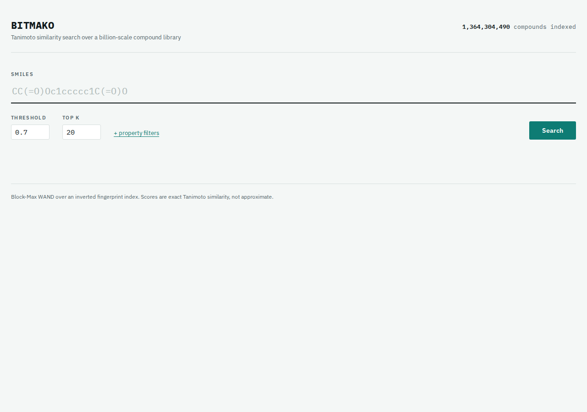
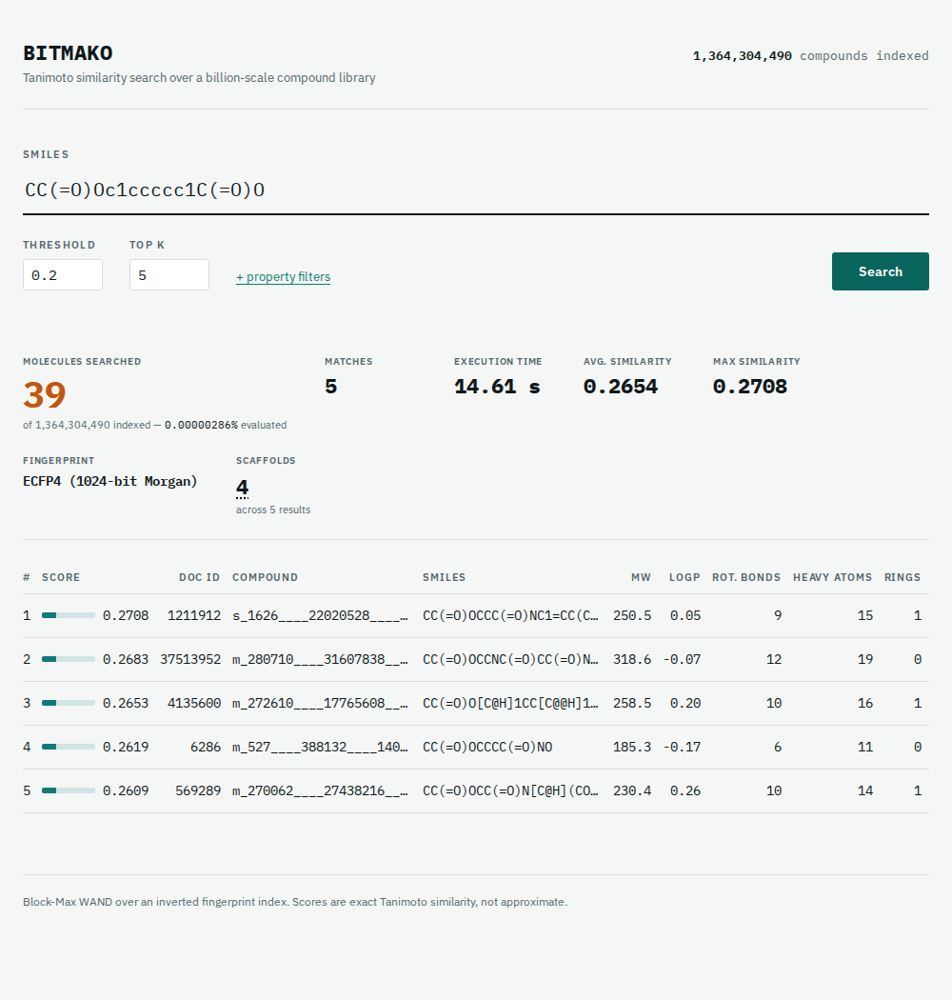
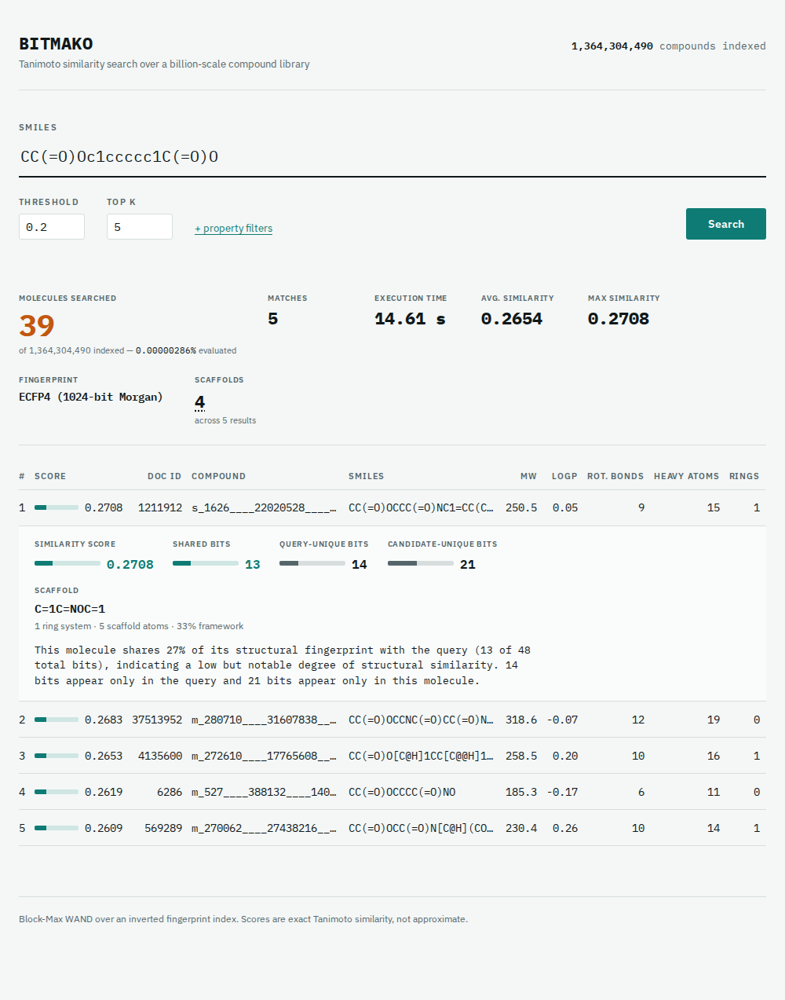

# BitMako

**Exact, billion-scale molecular similarity search — in pure Rust.**

[](https://www.rust-lang.org)
[](#license)
[](#usage)
[](#scale-this-build)
[](#testing)

> Query 1.36 billion molecules for near-neighbors in seconds, on a single
> workstation, with results that are provably exact — not approximate.

---

## Table of Contents

- [The Problem](#the-problem)
- [What BitMako Does](#what-bitmako-does)
- [Screenshots](#screenshots)
- [Features](#features)
- [Scale (This Build)](#scale-this-build)
- [Architecture Overview](#architecture-overview)
- [Similarity Analysis](#similarity-analysis)
- [Search Statistics](#search-statistics)
- [Scaffold Analysis, Diversity Picking & R-Group Decomposition](#scaffold-analysis-diversity-picking--r-group-decomposition)
- [Design Decisions](#design-decisions)
- [Engineering Challenges](#engineering-challenges)
- [Benchmark Results](#benchmark-results)
- [Usage](#usage)
- [API Documentation](#api-documentation)
- [On-Disk Formats](#on-disk-formats)
- [Known Limitations](#known-limitations)
- [Future Roadmap](#future-roadmap)
- [Testing](#testing)
- [License](#license)

---

## The Problem

Drug discovery starts with a simple question: **"What else looks like this
molecule?"**

A chemist with a promising compound — one that binds a disease target, say —
wants to find its close structural relatives inside a virtual catalog of
billions of purchasable or synthesizable molecules. Compounds that are
*structurally similar* tend to share biological activity (the "similar
property principle"), so this search is one of the first and most repeated
steps in early-stage drug discovery: lead identification, scaffold hopping,
and structure–activity-relationship (SAR) exploration all depend on being
able to ask "find me more like this" and get an answer back quickly.

The catalogs keep growing. [Enamine REAL](https://enamine.net/compound-collections/real-compounds/real-database-subsets),
one of the largest commercially accessible virtual libraries, now spans
**over 1.3 billion make-on-demand compounds**. At that scale, comparing a
query molecule against every single entry — a "linear scan" — is no longer
a matter of seconds: it takes tens of minutes to hours on a single machine,
even with a heavily optimized inner loop. Do that for every candidate in a
drug-discovery campaign, or expose it as an interactive tool a chemist can
use at the speed of thought, and brute force simply doesn't work.

**BitMako is an index and search engine purpose-built to answer that
question at that scale — in seconds, exactly, without approximation —
on ordinary workstation hardware.**

It ingests a raw compound library, encodes each molecule as a fingerprint
that captures its local chemical structure, builds an index over those
fingerprints, and then answers "find the top-k most similar compounds to
this query" using an algorithm (Block-Max WAND) borrowed from web-scale
text search — repurposed here for chemistry — that never touches the vast
majority of the corpus per query.

## What BitMako Does

1. **Ingests** a bzip2-compressed CXSMILES dump, computing an ECFP4-style
   1024-bit Morgan fingerprint and molecular properties (MW, LogP, rotatable
   bonds, heavy atoms, ring count) for every compound, and writes them to a
   columnar [Lance](https://lancedb.github.io/lance/) dataset.
2. **Builds an inverted index** (1024 posting lists, one per fingerprint bit)
   with per-block max-popcount metadata for Block-Max WAND pruning.
3. **Builds a flat fingerprint store** — a memory-mappable file of every
   fingerprint, addressed directly by `doc_id`.
4. **Builds a flat property store** — a memory-mappable file of MW, LogP,
   rotatable bonds, heavy atoms, and ring count per compound, also addressed
   by `doc_id`.
5. **Searches** for the top-k most Tanimoto-similar compounds to a query
   SMILES, using BMW dynamic pruning to avoid scanning the full corpus.
   Property filters (`--mw-max`, `--logp-max`) are evaluated inside the pivot
   loop via O(1) mmap reads — before the fingerprint fetch — so the engine
   returns exactly top-k filtered results with no over-fetch. Each result
   also carries a **Similarity Analysis**: shared/unique fingerprint bit
   counts and a generated explanation of the match, computed as a cheap
   post-processing step over the returned results — never inside the pivot
   loop, so it costs nothing in search performance.
6. **Batch-searches** a file of SMILES queries (`search-batch`) against one
   shared, mmap'd `Searcher` in parallel across CPU cores (Rayon), writing
   results to stdout or a TSV file.
7. **Serves an HTTP API** (`serve`) — an Axum server wrapping the same
   `Searcher`, loaded once and shared across all requests, so similarity
   search is network-queryable instead of requiring a CLI process per query.
   Visiting the server root in a browser serves a single-page search UI
   (embedded in the binary, no separate deploy step) with a results table and
   a live view of the engine's pruning ratio for each query.

## Screenshots

**Search UI, idle state** — SMILES input, threshold/top-k controls, and the
collapsed property-filter panel:



**Search Statistics dashboard and results** — after a query, a compact
dashboard summarizes it (molecules searched against the full corpus,
matches, execution time, fingerprint type, average/maximum similarity, and,
when `--lance` is attached, how many distinct Bemis-Murcko scaffolds and
R-group SAR tables the result set spans), followed by the ranked results
table with Tanimoto scores, an inline peak-bar per result, and resolved
SMILES/property columns:



**Similarity Analysis panel, expanded** — clicking "Analysis" on any result
reveals the bit-level breakdown behind its score, a proportional bar per
number, a generated explanation of the match, its Bemis-Murcko scaffold, and
the R-groups stripped to reach it, without cluttering the default table view:



> Rendered from the shipped `static/index.html` with representative sample
> data standing in for a live 1.36B-compound backend.

## Features

- **Exact top-k Tanimoto similarity search** over corpora of 1B+ compounds —
  no approximation, no ANN recall loss.
- **Block-Max WAND pruning** — evaluates exact similarity for roughly
  **1 in 10 million** compounds per query (>99.999999% pruning rate).
- **Streaming, skip-indexed posting lists** — bounded per-query memory
  regardless of corpus size; no full posting-list decode, no OOM.
- **In-loop property filtering** (MW, LogP, rotatable bonds, heavy atoms,
  ring count) evaluated at O(1) mmap cost *before* the expensive fingerprint
  fetch — filtered queries return exactly `top_k` results with zero over-fetch.
- **Parallel batch search** (`search-batch`) — thousands of queries against
  one shared, mmap'd index, fanned out across all CPU cores via Rayon.
- **Network-queryable HTTP API** (`serve`, built on Axum/Tokio) with a
  single shared in-memory `Searcher` — no per-query process spin-up.
- **Embedded single-page search UI** — served directly from the compiled
  binary (`include_str!`), zero separate deploy artifact.
- **Similarity Analysis panel** — every result carries a bit-level breakdown
  (shared / query-unique / candidate-unique fingerprint bits) and a
  generated 1–2 sentence explanation of *why* it matched, computed fresh from
  the actual fingerprint comparison — not canned text. Costs one extra mmap
  read per *returned* result, not per candidate evaluated, so it doesn't
  touch WAND's pruning loop or its performance.
- **Search Statistics dashboard** — a compact strip above the results
  showing molecules searched, match count, execution time, fingerprint type,
  and average/maximum similarity for the query that just ran. Built almost
  entirely from data the API was already returning; no charts, no history,
  just the current query's own numbers.
- **Bemis-Murcko scaffold extraction & grouping** — every result's ring
  system + linkers, reduced from the molecular graph's 2-core with no
  separate ring-perception pass, canonicalized via iterative color
  refinement so a shared scaffold hashes identically regardless of how its
  SMILES was written. See [Scaffold Analysis, Diversity Picking & R-Group
  Decomposition](#scaffold-analysis-diversity-picking--r-group-decomposition).
- **Scaffold-based diversity picking** (`--diverse`) — collapses same-core
  hits down to their best-scoring representative, so a result set spans as
  many distinct chemical cores as the candidate pool allows.
- **R-group decomposition & SAR tables** — each result's substituents,
  aligned across every result sharing a scaffold into consistent R1/R2/…
  columns by attachment position — the classic structure-activity-relationship
  table, computed automatically.
- **Memory-bounded index construction** — multi-pass builder trades peak RAM
  against pass count, so a 70 GB index can be built without loading it whole.
- **Verified-exact streaming search** — the skip-cursor implementation is
  tested against an exhaustive linear scan across many queries/thresholds in
  the test suite; results are bit-for-bit identical.
- **Pure Rust, no GPU, no external services** — runs entirely on commodity
  workstation hardware; the only heavyweight dependency is Lance for
  columnar storage.

## Scale (This Build)

| Artifact | Value |
|---|---|
| Compounds ingested | 1,364,304,490 (0 parse failures) |
| Lance dataset | ~333 GB |
| Inverted index | ~70 GB |
| Flat fingerprint store | ~163 GB (128 bytes/compound) |
| Flat property store | ~27 GB (20 bytes/compound) |
| Ingest throughput | ~270k compounds/sec (single bzip2 stream) |

## Architecture Overview

```
 .bz2 CXSMILES
      │  stream-decompress (crossbeam backpressure)
      ▼
 raw line chunks ──rayon──▶ SMILES parse + Morgan FP + properties
      │
      ▼
 Arrow RecordBatches ──▶ Lance dataset  (compounds.lance)
      │
      ├── build-index ──────▶ inverted index    (compounds.bitmako)
      │        └── build-skip ──▶ skip index    (compounds.skip)
      ├── build-fp-store ───▶ flat fingerprints (compounds.fp)
      └── build-prop-store ─▶ flat properties   (compounds.prop)
                                   │                    │
 query SMILES ──▶ BMW engine ◀─────┘                    │
                     │  1. WAND pivot: min-shared-bits   │
                     │  2. Property pre-screen ◀─────────┘ O(1) mmap
                     │  3. Fingerprint fetch + exact Tanimoto
                     ▼
              top-k (doc_id, Tanimoto) — already filtered
```

### Component layers

| Layer | Responsibility |
|---|---|
| **ETL** (`src/etl/`) | Streaming bzip2 decompression, pure-Rust SMILES parsing, ECFP4 fingerprinting, property computation, Arrow/Lance writing |
| **Index** (`src/index/`) | Multi-pass inverted-index builder, delta+varint posting-list codec, skip-index sidecar, mmap-backed lazy reader |
| **Search** (`src/search/`) | Streaming `StreamCursor`, `BmwEngine` (WAND pivoting), `FpStore`/`PropStore` mmap accessors, Tanimoto kernel |
| **API** (`src/api.rs`) | Axum HTTP server: `AppState`, health/search routes, embedded static UI |
| **CLI** (`src/main.rs`) | `ingest`, `build-index`, `build-skip`, `build-fp-store`, `build-prop-store`, `search`, `search-batch`, `serve`, `bench-linear`, `verify` |

### Fingerprints

ECFP4 (radius 2), 1024 bits stored as `[u64; 16]`. A pure-Rust SMILES parser
builds the molecular graph; atom environments are hashed with CRC32 over two
iterations.

### Tanimoto similarity

`|A ∩ B| / |A ∪ B|` = `popcount(A & B) / popcount(A | B)`, computed over the
16 words with POPCNT. Compiled with `target-cpu=native` so LLVM
autovectorizes the inner loop.

### WAND search with streaming posting lists

Posting lists are delta + LEB128-varint encoded in 128-doc blocks. Search
runs document-at-a-time over the active-bit lists with two key properties:

1. **Min-shared-bits pivoting.** A doc sharing `c` of the query's bits has
   Tanimoto `c/(P+K−c) ≤ c/P`, so reaching threshold `t` requires
   `c ≥ ⌈t·P⌉` shared bits. The engine jumps directly to docs appearing in
   `≥ θ` posting lists (the WAND pivot), and reads the exact intersection
   size `c` for free from how many cursors align at the pivot — a tight
   upper bound before any fingerprint fetch. `θ` rises as the top-k heap
   fills, tightening pruning.
2. **Streaming, skip-indexed cursors.** Each cursor decodes one 128-doc block
   at a time straight from the mmap'd index. `advance_to` consults the
   **skip index** (`compounds.skip`) to binary-search the block containing
   the target and decodes only that block — so jumping over a list of
   hundreds of millions of postings costs O(log blocks + one block), and
   resident memory per query is a few blocks rather than the whole lists.
   This is what keeps common-fragment queries from OOM-ing (the naive
   "decode every active list" approach needs tens of GB and can exceed RAM).

For each surviving pivot, the engine optionally checks molecular properties
from the mmap'd flat property store (O(1), 20 bytes) before fetching the
fingerprint (128 bytes). Compounds failing a property filter never reach the
exact-Tanimoto step and never enter the heap — so `top_k` results come back
already filtered and no over-fetch heuristic is needed.

Surviving pivots then fetch the fingerprint from the mmap'd flat fingerprint
store, compute exact Tanimoto, and update the top-k min-heap.

The streaming cursor is verified against an exhaustive linear scan in the
test suite (identical results across many queries × thresholds).

## Similarity Analysis

A Tanimoto score answers "how similar," but not "similar *how*." The
Similarity Analysis panel closes that gap: for every result, it breaks the
score down into the actual bits driving it and generates a short explanation
from those numbers — surfaced as an expandable panel per row in the web UI,
extra fields on every `POST /search` result, and extra output lines under
the single-query `search` CLI command.

**What's computed**, for a query fingerprint `Q` and a candidate `C` (both
1024-bit):

| Field | Meaning |
|---|---|
| `shared_bits` | `popcount(Q & C)` — bits set in both |
| `query_unique_bits` | `popcount(Q & !C)` — bits set only in the query |
| `candidate_unique_bits` | `popcount(C & !Q)` — bits set only in the candidate |
| `explanation` | 1–2 sentences generated from the three counts above |

`shared_bits + query_unique_bits + candidate_unique_bits` is the Tanimoto
union, so `tanimoto = shared_bits / total` — recomputed here from the same
two fingerprints WAND already scored, and numerically identical to the
`score` field (verified in `search::analysis`'s test suite). The explanation
sentence bands the score into a qualitative tier (`high` ≥ 0.7, `moderate`
≥ 0.4, `low but notable` ≥ 0.2, `minimal` below that) purely to pick a word —
every number quoted in the sentence itself is the real, freshly computed
value for that specific pair, not a lookup or a template with blanks filled
from metadata.

In the web UI, all four numbers (score, shared, query-unique, candidate-unique)
get a small bar alongside the value, each sized against the same denominator
(the Tanimoto union) so the bars are directly comparable — the shared-bits
bar is always exactly as long as the score bar, since `shared/union` *is*
the score. Shared bits and the score reuse the results table's own teal
meter; the two "context" bars (query-only, candidate-only) are drawn from a
neutral gray ramp instead, so the one number that actually drove the ranking
stays visually distinct from the two that didn't. No new bar component was
introduced — same `peak-track`/`peak-fill` markup as the results table's
score column, just reused at a second size.

**Where it lives:** `src/search/analysis.rs` is a small, pure, dependency-free
module — one function, `analyze(query_fp, candidate_fp) -> SimilarityAnalysis`,
built entirely from two `[u64; 16]` arrays. It doesn't know about `Searcher`,
Lance, Axum, or HTTP; it's a fingerprint-comparison function with a test
suite that stands on its own. `Searcher::analyze_results` is the only glue:
it takes a search's own `(doc_id, score)` output, re-fetches each candidate's
fingerprint from the same flat `FpStore` mmap WAND itself reads from (one
O(1) lookup per result), and calls `analyze`. The HTTP API, the CLI, and any
future caller all go through that one method — no duplicated bit-counting
logic anywhere.

**Why this doesn't affect search performance:** `analyze_results` runs once,
*after* `search_with_stats` returns, over the already-ranked top-k list —
typically tens to a few hundred entries. It never runs inside `BmwEngine`'s
pivot loop, so it has zero effect on posting-list traversal, block-max
pruning, or the early-exit heuristic — the numbers in
[Benchmark Results](#benchmark-results) are unchanged. Concretely: computing
the analysis for 50 results costs 50 extra mmap reads (128 bytes each,
already page-cache-warm since WAND just read the same bytes to score them)
plus 50 sixteen-word bit scans — microseconds, not a measurable fraction of
a multi-second search.

**Scope:** wired into the HTTP API (`POST /search`, see
[API Documentation](#api-documentation)), the web UI (an expandable
"Analysis" panel per result row, collapsed by default so the results table
stays scannable), and the single-query `search` CLI command. Deliberately
*not* wired into `search-batch`'s TSV/stdout output — a multi-sentence prose
explanation doesn't fit a tabular bulk-export format, and anyone scripting
against batch results can call the same `analyze`/`analyze_results` functions
directly from the library.

## Search Statistics

A compact dashboard sits above the results table in the web UI, giving a
scan-at-a-glance summary of the query that just ran:

| Field | Source |
|---|---|
| Molecules searched | `docs_evaluated` — already returned by `search_with_stats` (WAND's own pruning counter) |
| Matches | `results.length` — the response's own result array |
| Execution time | New: wall-clock time around the `search_with_stats` call, in `handle_search` |
| Fingerprint type | New: a static constant (`FINGERPRINT_KIND` in `etl::fingerprint`), surfaced via `GET /health` |
| Average similarity | Computed client-side from `results[].score` — already on every result |
| Maximum similarity | Computed client-side from `results[].score` — already on every result |

Four of the six fields are values the API was already returning for other
reasons (the pruning-ratio hero readout and the results themselves); only
**execution time** and **fingerprint type** required new fields, and both are
cheap, single-value additions with no bearing on the search path itself —
timing wraps the existing call from the outside, and the fingerprint type is
a compile-time constant, not something computed per query.

**Where it lives:** the dashboard replaces what used to be a single
standalone "N of 1.36B evaluated" hero readout — that fact is still here
(now the dashboard's lead, amber-highlighted cell, "Molecules Searched"),
just folded into one compact strip with the other five stats instead of
occupying its own section. No second "stats area" was added above the
results; the existing one grew from one fact to six. All of the layout and
number-formatting logic lives in `static/index.html`'s existing `<script>`
block, styled with the same label/value visual pattern already established
for the [Similarity Analysis](#similarity-analysis) panel (uppercase mono
labels, bold mono values) — no new colors, fonts, or components.

**Why this doesn't affect search performance:** `search_time_ms` is measured
with `std::time::Instant` wrapped *around* the existing `search_with_stats`
call — it observes the search, it doesn't participate in it. The average/max
similarity are `Array.reduce`-style passes over the already-fetched top-k
results in the browser, not a second query. Nothing here touches
`BmwEngine`, the posting lists, or adds a request to the server.

**Deliberately excluded:** no charts, sparklines, or historical/trend views —
just the current query's own numbers, matching the existing UI's restrained,
instrument-readout aesthetic rather than turning the page into an analytics
dashboard.

## Scaffold Analysis, Diversity Picking & R-Group Decomposition

A Tanimoto score ranks hits; it doesn't tell a chemist the thing they
actually reason about next — which hits share the same chemical *core*
(the classic lead-identification and scaffold-hopping questions from
[The Problem](#the-problem)), and what varies at the positions that differ.
Three features answer that, all built on the same foundation and all gated
on `--lance` (they need each candidate's SMILES text, not just its
fingerprint):

**Real example**, captured live against the 1.36B-compound corpus — query
`CC(=O)Oc1ccccc1O` (2-acetoxyphenol, a catechol mono-acetate ester),
threshold 0.2, top-10:

### Bemis-Murcko scaffold extraction

For each result, the ring systems plus the atoms linking them, with
terminal substituents stripped away:

| Field | Meaning |
|---|---|
| `scaffold_smiles` | The scaffold, rendered as SMILES; empty if the molecule is acyclic |
| `ring_systems` | Distinct fused-ring clusters (biphenyl's two rings = 2; naphthalene's fused pair = 1) |
| `ring_count` | Total independent rings across all ring systems |
| `scaffold_atoms` / `linker_atoms` | Atoms retained overall, and how many of those are non-ring bridges |
| `framework_fraction` | `scaffold_atoms / heavy_atoms` — how much of the molecule is core vs. side chain |
| `scaffold_key` | A stable hash of the scaffold's *graph structure*, not its display string — identical for two molecules sharing a scaffold regardless of how their SMILES was written |

The algorithm needs no separate ring-perception pass: the Bemis-Murcko
framework is exactly the molecular graph's **2-core** (iteratively strip
every atom with degree ≤ 1 until none remain). **Tarjan bridge-finding**
over what's left classifies each edge as ring or linker. **Iterative color
refinement** (1-Weisfeiler-Leman — the same "hash your neighborhood, repeat"
idea the ECFP4 fingerprinter itself uses) assigns each atom a canonical
color from its structure alone, never its position in the original SMILES
string; `scaffold_key` is hashed from that color histogram plus the
edge-color multiset, which is what makes it stable across relabelings —
verified directly in the test suite: `analyze("c1ccccc1")`,
`analyze("Cc1ccccc1")` (toluene), and the benzene ring inside aspirin's own
SMILES all hash to the *same* `scaffold_key`, despite being three
differently-written molecules.

Result #1 from the live run: `CC(=O)O[C@H]1CC[C@@H]1C(=O)OCC1CCC(=O)N1`
(score 0.2917) reduces to scaffold `C1CC(C1)COCC2CCCN2` — 2 ring systems,
12 scaffold atoms, 67% of the molecule is core. Across all 10 results, the
CLI also prints a grouping summary:

```
10 results span 9 distinct scaffolds
  C1=CC=CC=C1 × 2
  C1CC(C1)COC2=CC=CC=C2 × 1
  C1CC(C1)COCC2=CC=CC=C2 × 1
  ...
```

### Diversity picking (`--diverse` / `"diverse": true`)

Ten close analogs of the same core tell a chemist less than ten hits
spanning ten different cores. `--diverse` collapses same-scaffold hits down
to their single best-scoring representative — `scaffold::diverse_indices`
walks the already score-ranked result list and keeps the first (i.e.
highest-scoring) occurrence of each `scaffold_key`, dropping the rest.
Acyclic hits (`scaffold_key == 0`) are never collapsed into each other —
they're structurally unrelated molecules that only share the *absence* of a
scaffold, so merging them would erase real diversity rather than add it.

On the live query above, results #7 and #10 were the only pair sharing a
scaffold (a bare benzene ring, `C1=CC=CC=C1`). Re-running with `--diverse`:

```
(--diverse: 10 eligible candidates span 9 distinct scaffolds; showing top 9)
9 results span 9 distinct scaffolds
  C1=CC=CC=C1 × 1
  ...
```

— #10 dropped, #7 (the higher-scoring of the pair) kept, every remaining
scaffold now appears exactly once. This is a deliberately simple pick, not
a fingerprint-based MaxMin/Taylor-Butina diversity selector: it post-processes
the same top-k WAND already returned rather than over-fetching for a fuller
selection, so a diverse response can come back shorter than `top_k` — the
tradeoff is explicit in both the CLI's summary line and the API response's
shorter `results` array.

### R-group decomposition & SAR tables

The complement to "what's the shared core": *what varies*. `decompose`
splits a molecule into its scaffold plus the substituents removed to reach
it, each tagged with where it attaches. This falls out of the 2-core
definition almost for free: since any ring survives the 2-core reduction,
every atom the reduction *strips* is necessarily part of an acyclic
fragment, and that fragment touches the scaffold at exactly one bond (a
second attachment point would put its atoms on a cycle, and cycles survive
the 2-core) — so "one dead connected component" and "one R-group" coincide
exactly, no extra bookkeeping required to tell them apart.

Result #1's three R-groups, from the live run:

```
r_groups: C: *OC(C)=O, C: *=O, C: *=O
```

(an acetate ester and two exocyclic carbonyl oxygens — the lactam ring's
`C=O` and the linker ester's `C=O` are both, correctly, outside the
Bemis-Murcko ring skeleton under this definition, not silently dropped).

The more interesting piece is **aligning substituents across molecules that
share a scaffold** into an actual SAR table — `r_group_tables` builds one
per scaffold shared by 2+ results, with columns keyed by each substituent's
`attach_color`: the same canonical 1-Weisfeiler-Leman color scaffold
extraction already computes, which is provably stable across any two
molecules sharing that scaffold. Two positions with the same color are the
same structural attachment point no matter which molecule they came from —
that's the column; two positions that happen to be graph-symmetric (like
every position on a bare benzene ring) collapse into the *same* column,
which the test suite checks explicitly (2- vs. 3-methylpyridine align into
two separate columns since pyridine's nitrogen breaks the ring's symmetry;
toluene and benzoic acid's substituents land in the *same* single column,
since benzene has none).

On the live query, results #7 and #10 (the shared-benzene-scaffold pair
from above) produce exactly one such table:

```json
{
  "scaffold_smiles": "C1=CC=CC=C1",
  "columns": [{ "label": "R1", "attach_symbol": "C" }],
  "rows": [
    { "member_index": 6, "cells": [["*F", "*F", "*SCCOC(C)=O"]] },
    { "member_index": 9, "cells": [["*F", "*F", "*OCCOC(C)=O"]] }
  ]
}
```

Both molecules' three substituents collapse into the single `R1` column
because benzene's full symmetry gives every ring position the same color —
a documented simplification, not a bug: disambiguating symmetric positions
by their substituents would need a second refinement pass this module
deliberately doesn't do.

### Where these live, and why they don't affect search performance

All three are pure functions of a SMILES string in `src/search/scaffold.rs`
— it doesn't know about `Searcher`, Lance, or HTTP, and reuses
`etl::fingerprint`'s existing SMILES→graph parser (`pub(crate)`-exposed for
exactly this) rather than adding a third independent SMILES scanner. 23 unit
tests cover the graph algorithms directly: canonicalization invariance,
ring-system/linker counting on hand-picked molecules (naphthalene, biphenyl,
charged rings), R-group extraction and its determinism, and both alignment
cases above. `Searcher::scaffold_results`/`rgroup_results` are the only
glue — same shape as `analyze_results` (see
[Similarity Analysis](#similarity-analysis)): given SMILES a caller already
resolved via Lance, map the pure function over them. Like Similarity
Analysis, this runs once over the (small) already-ranked top-k list, never
inside `BmwEngine`'s pivot loop — a 2-core reduction and a handful of
Weisfeiler-Leman refinement rounds over a few dozen atoms, tens to a few
hundred times per query, has no measurable effect on WAND's own pruning or
the [Benchmark Results](#benchmark-results) numbers.

**Scope:** wired into `search` (always shown with `--lance`, no flag — same
gating as Similarity Analysis; `--diverse` is opt-in), `POST /search` (see
[API Documentation](#api-documentation)), and the web UI (a Scaffold +
R-Groups block in each result's Analysis panel, plus collapsible
"Scaffolds"/"R-Groups" summary panels above the results table). Not wired
into `search-batch` — an SAR table doesn't fit a tabular bulk-export format,
and the same `scaffold`/`decompose`/`r_group_tables` functions are one
import away for anyone scripting against the library directly.

## Design Decisions

- **Exact results over approximate nearest neighbors.** Approximate
  similarity search (LSH, HNSW, product quantization) trades recall for
  speed. BitMako instead makes the *pruning* exact and provable — the
  min-shared-bits bound guarantees no true top-k result is ever skipped —
  so speed comes from ruling out candidates mathematically, not from
  sampling or accepting recall loss. This matters in drug discovery, where
  silently missing a real hit is a worse failure mode than a slower query.
- **Inverted index over the fingerprint bits, not the compounds.** Framing
  fingerprint similarity as a WAND-style disjunctive query (one posting
  list per bit, one term per compound) reuses a decades-proven web-search
  data structure and algorithm for a domain — chemistry — it wasn't
  originally designed for, instead of building a bespoke ANN structure.
- **Streaming/skip-indexed posting lists over full in-memory decode.** A
  common fragment's posting list can span hundreds of millions of entries.
  Decoding it fully is both slow and, at this corpus size, an OOM risk. A
  skip index that lets a cursor binary-search to the right 128-doc block
  keeps per-query memory bounded by the query, not the corpus.
  See [Engineering Challenges](#engineering-challenges).
- **A separate flat fingerprint/property store, keyed by `doc_id`, next to
  the inverted index.** The index alone can prune, but confirming a
  candidate's exact Tanimoto or its molecular properties needs direct O(1)
  random access — a flat mmap'd array is the simplest structure that
  provides that without going back through Lance/Arrow's row-oriented
  columnar reader on the hot path.
- **In-loop property filtering instead of post-filtering.** An earlier,
  simpler design fetched `top_k × N` unfiltered candidates and then dropped
  non-matches (implemented and kept as the legacy `--lance` fallback path).
  Moving the property check *before* the fingerprint fetch, using the flat
  property store, both removes the risk of returning fewer than `top_k`
  results under restrictive filters and measurably speeds up filtered
  queries (3.7×, see [Benchmarks](#benchmark-results)).
- **One shared, `Sync` `Searcher` for batch and server modes**, rather than
  one instance per query/thread. Every field of `Searcher` is a read-only
  mmap, so it can be shared across threads and Axum request handlers without
  locking — batch queries fan out over Rayon and HTTP requests fan out over
  Tokio against the exact same in-memory structures used by the CLI's
  single-query path.
- **Embedding the search UI in the binary** (`include_str!`) rather than
  serving it from a separate static-file deploy step. The engine is meant to
  run as a single self-contained artifact on a workstation; a second
  deployment target for the frontend would be disproportionate to its size
  (one HTML file).
- **Similarity Analysis as a post-search pass, not a WAND feature.** The
  bit-level breakdown behind each result (shared/unique bits, the generated
  explanation) is computed by re-comparing two already-fetched fingerprints
  *after* WAND has already picked the top-k — never inside the pivot loop,
  which only ever sees fingerprints for candidates it's still deciding about,
  most of which it prunes without a full comparison. Computing the analysis
  for the small returned result set (≤ a few hundred) costs a handful of
  extra O(1) mmap reads and 16-word bit scans; running it inside the hot loop
  instead would mean doing that work for every candidate WAND *rules out*,
  which is exactly the cost WAND's pruning exists to avoid. See
  [Similarity Analysis](#similarity-analysis).
- **Pure Rust, no GPU.** The bottleneck at this scale is I/O and posting-list
  traversal, not floating-point throughput — GPU acceleration wouldn't
  address the actual cost center, whereas `target-cpu=native` POPCNT/AVX2
  already saturates the Tanimoto inner loop.

## Engineering Challenges

Problems actually hit while building this, and how they were resolved:

| Challenge | Resolution |
|---|---|
| **32-bit posting-list offsets overflowed at >4 GiB.** The original index format used `u32` byte offsets; the full 70 GB index exceeds that range. | Moved to a v2 format with 64-bit offsets throughout the on-disk layout. |
| **Full posting-list decode OOM'd on common fragments.** Decoding an entire list of hundreds of millions of postings before intersecting it could exceed available RAM (an 8 GB allocation crash was observed on a medium drug-like query). | Replaced with `StreamCursor` + a skip-index sidecar (`compounds.skip`): cursors decode one 128-doc block at a time and jump via binary search on skip metadata, bounding resident memory to a handful of blocks per query regardless of list length. |
| **Property filtering without over-fetching.** Filtering post-hoc on Lance-resolved properties (`--mw-max`/`--logp-max`) risked returning fewer than `top_k` results under restrictive filters, and wasted work fetching fingerprints for compounds that would be discarded anyway. | Built a flat, mmap'd property store keyed by `doc_id` and moved the filter check inside the WAND pivot loop, before the fingerprint fetch — filtering is now O(1) and exact-count-preserving; the old Lance post-filter path is kept only as a fallback when no prop-store is available. |
| **Building a 70 GB index without unbounded memory.** A naive single-pass builder holding all 1024 posting lists in RAM at once doesn't fit on a workstation. | Multi-pass builder holding only `--bits-per-pass` posting lists in memory at a time (default 32 ≈ 33 scans; 64 bits/pass ≈ 17 scans at ~10 GB peak) — a direct RAM/scan-count tradeoff exposed as a CLI flag. |
| **Verifying billion-scale correctness without a reference oracle.** There's no independent 1.36B-compound similarity search to diff results against. | Added a `verify` command that walks the built index and confirms doc_id alignment against the Lance source (0 mismatches across all 1,364,304,490 compounds), and unit/integration tests that check the streaming skip-cursor against an exhaustive linear scan across many queries and thresholds. |
| **Fat LTO makes every iteration slow.** `lto = "fat"`, `codegen-units = 1` (needed for the Tanimoto inner loop to autovectorize well) pins one core through a single-threaded LLVM merge over Lance's entire dependency graph (DataFusion, Arrow, Tantivy, AWS SDK) — 12–24 minutes per release build regardless of how small the source diff is. | Accepted as a fixed cost of the performance profile; validated changes against `cargo test --release` first (faster, though still not instant) before committing to a full rebuild. |
| **Interrupted 1.36B-compound ingest.** A session disconnect partway through ingest (at 689.5M compounds) left a partial dataset. | Restarted ingest from scratch — streaming ETL has no partial-resume path currently, noted as a possible roadmap item. |
| **`git filter-branch` needing a clean tree, and history rewrites for a public portfolio repo.** Cleaning committer identity and stripping stray Claude co-author trailers out of history (see project notes) required `filter-branch` to run against a fully clean working tree. | Stashed pending edits, ran a combined `--env-filter`/`--msg-filter`/`--index-filter` pass, verified the rewritten history against both the local repo and the GitHub API before force-pushing. |

## Benchmark Results

All measurements on a single workstation, Windows 11, 32 GB RAM.
Rust release build: `lto = "fat"`, `codegen-units = 1`, `opt-level = 3`,
`target-cpu = native`. Corpus: Enamine REAL, **1,364,304,490 compounds**.
Full detail and methodology notes in [BENCHMARKS.md](BENCHMARKS.md).

### Linear scan baseline

Sequential Tanimoto scan over the flat fingerprint store (163 GB), no index,
no pruning — equivalent to a brute-force RDKit similarity screen.

| Metric | Value |
|---|---|
| Throughput | 1,576,536 compounds/sec |
| Full-corpus time (extrapolated from 10M sample) | **865 s (14.4 min)** |

### WAND similarity search vs. linear scan

Exact top-10 most Tanimoto-similar compounds, no approximation:

| Compound | Query size | Threshold | WAND time | Docs evaluated | Eval fraction | vs. linear |
|---|---|---|---|---|---|---|
| Ethanol | 5 bits | 0.15 | 2.7 s | 92 | 6.7 per billion | **320×** |
| Benzoic acid | 17 bits | 0.20 | 7.7 s | 27 | 2.0 per billion | **112×** |
| Paracetamol | 22 bits | 0.25 | 8.4 s | 50 | 3.7 per billion | **103×** |
| Aspirin | 24 bits | 0.25 | 17 s | 26 | 1.9 per billion | **51×** |
| Ibuprofen | 28 bits | 0.30 | 14 s | 29 | 2.1 per billion | **62×** |

WAND evaluates between **26 and 92 documents** out of 1.36 billion to find
top-10 results — a pruning rate of **>99.999999%**. The dominant cost is
posting-list traversal, not fingerprint evaluation.

### Property-filtered search: in-loop vs. post-filter

| Query | Filters | Mode | Time |
|---|---|---|---|
| Benzoic acid @ 0.20, top-10 | mw ≤ 350, logP ≤ 3 | `--prop-store` (in-loop) | **8 s** |
| Benzoic acid @ 0.20, top-10 | mw ≤ 350, logP ≤ 3 | `--lance` post-filter (20× over-fetch) | 30 s |

**3.7× faster** than the Lance post-filter path for equivalent results.

## Usage

Requires Rust (with the MSVC toolchain on Windows) and
[`protoc`](https://github.com/protocolbuffers/protobuf) (Lance uses Protocol
Buffers). Set `PROTOC` to the compiler path if it isn't on `PATH`.

```bash
cargo build --release

# 1. Ingest the bz2 dump → Lance dataset
bitmako ingest        --input REAL.cxsmiles.bz2 --output compounds.lance

# 2. Build the inverted index (multi-pass, memory-bounded)
bitmako build-index   --lance compounds.lance   --output compounds.bitmako --bits-per-pass 64

# 3. Build the skip index from the index (single pass, no rebuild)
bitmako build-skip    --index compounds.bitmako --output compounds.skip

# 4. Build the flat fingerprint store
bitmako build-fp-store   --lance compounds.lance  --output compounds.fp

# 5. Build the flat property store (~27 GB, one Lance scan)
bitmako build-prop-store --lance compounds.lance  --output compounds.prop

# 6. Search (doc_id + Tanimoto only)
bitmako search --index compounds.bitmako --skip compounds.skip --fp-store compounds.fp \
    --query "OC(=O)c1ccccc1" --threshold 0.3 --top-k 10

# 6b. Search with SMILES / property lookup (add --lance)
bitmako search --index compounds.bitmako --skip compounds.skip --fp-store compounds.fp \
    --lance compounds.lance \
    --query "OC(=O)c1ccccc1" --threshold 0.3 --top-k 10

# 6c. Search with property filters — fast path (in-loop, no over-fetch)
bitmako search --index compounds.bitmako --skip compounds.skip --fp-store compounds.fp \
    --prop-store compounds.prop \
    --query "OC(=O)c1ccccc1" --threshold 0.1 --top-k 10 \
    --mw-max 350 --logp-max 3

# 6d. Search with property filters + SMILES output (combine --prop-store and --lance)
bitmako search --index compounds.bitmako --skip compounds.skip --fp-store compounds.fp \
    --prop-store compounds.prop --lance compounds.lance \
    --query "OC(=O)c1ccccc1" --threshold 0.1 --top-k 10 \
    --mw-max 350 --logp-max 3

# 6e. Diverse results — one best-scoring hit per distinct scaffold, plus
#     scaffold/R-group/SAR-table output (requires --lance; see Scaffold
#     Analysis, Diversity Picking & R-Group Decomposition)
bitmako search --index compounds.bitmako --skip compounds.skip --fp-store compounds.fp \
    --lance compounds.lance \
    --query "OC(=O)c1ccccc1" --threshold 0.1 --top-k 10 --diverse

# 7. Batch search — one query per line of a .smi file ("SMILES [ID]"), run in
#    parallel across CPU cores against a single shared Searcher
bitmako search-batch --index compounds.bitmako --skip compounds.skip --fp-store compounds.fp \
    --queries queries.smi --threshold 0.3 --top-k 20

# 7b. Batch search with SMILES/property resolution and results written to a TSV file
bitmako search-batch --index compounds.bitmako --skip compounds.skip --fp-store compounds.fp \
    --lance compounds.lance --queries queries.smi --threshold 0.3 --top-k 20 \
    --output results.tsv --stats

# 8. Serve an HTTP API on 127.0.0.1:8080
bitmako serve --index compounds.bitmako --skip compounds.skip --fp-store compounds.fp \
    --prop-store compounds.prop --lance compounds.lance --port 8080
```

### Batch query mode

`search-batch` reads one SMILES query per line from a `.smi` file (blank
lines and `#`-comments skipped; an optional second whitespace-separated
column supplies a query ID, defaulting to `Q<line>`), then runs every query
through **one** shared `Searcher` — reusing the same mmap'd
index/skip/fp-store/prop-store handles instead of re-opening them per query
— in parallel across CPU cores via Rayon.

A query that fails (e.g. unparseable SMILES) is captured as a per-query
error and does not abort the rest of the batch. Results print to stdout by
default, or to a TSV file with `--output`. `--lance` resolves
SMILES/properties per result via one `Dataset::take` call per query.
Property filters (`--mw-max`/`--logp-max`) require `--prop-store` in batch
mode — the legacy `--lance` 20×-over-fetch path isn't supported here, to
keep the parallel/batched result flow simple. `--threads N` overrides
Rayon's default thread pool size.

### `build-index` is memory-bounded

The builder runs in multiple passes, holding only `--bits-per-pass` posting
lists in RAM at once (default 32, ~33 scans). Higher values are faster but
use more RAM: 64 bits/pass ≈ 17 scans on ~10 GB peak. The index uses 64-bit
posting offsets, so the posting section can exceed 4 GiB (the full build is
~70 GB).

## API Documentation

`serve` loads the index, skip index, and fp-store (plus optional prop-store
and Lance dataset) once and shares them across every request via `Arc`, so a
query no longer requires spawning a CLI process — the mmap'd handles stay
warm in the running server. Built on Axum over a multi-thread Tokio runtime.

### `GET /`

Serves the embedded single-page search UI (`static/index.html`, baked into
the binary via `include_str!` — no separate build step or deploy artifact).
Property-filter inputs auto-disable when `/health` reports no prop-store
attached. A compact [Search Statistics](#search-statistics) dashboard sits
above the results table for every query. Each result row also carries a
collapsed "Analysis" toggle exposing its
[Similarity Analysis](#similarity-analysis) panel — the bit-level breakdown
and generated explanation — without cluttering the default table view.

### `GET /health`

```json
{
  "status": "ok",
  "compounds": 1364304490,
  "lance_attached": true,
  "prop_store_attached": true,
  "fingerprint_type": "ECFP4 (1024-bit Morgan)"
}
```

### `POST /search`

**Request body**

```json
{
  "smiles": "CC(=O)Oc1ccccc1O",
  "threshold": 0.2,
  "top_k": 10,
  "mw_max": 350,
  "logp_max": 3,
  "diverse": false
}
```

| Field | Type | Required | Default | Notes |
|---|---|---|---|---|
| `smiles` | string | yes | — | Query molecule |
| `threshold` | float | no | `0.7` | Minimum Tanimoto similarity |
| `top_k` | integer | no | `50` | Max results returned |
| `mw_max` | float | no | — | Requires server started with `--prop-store` |
| `logp_max` | float | no | — | Requires server started with `--prop-store` |
| `diverse` | bool | no | `false` | Requires `--lance`; see [Diversity Picking](#scaffold-analysis-diversity-picking--r-group-decomposition) |

**Response body** — real output from the live 1.36B-compound corpus
(trimmed to one result; full response has 10):

```json
{
  "query_smiles": "CC(=O)Oc1ccccc1O",
  "query_pop": 24,
  "results": [
    {
      "doc_id": 14324478,
      "score": 0.29166666,
      "compound_id": "m_1458____26632154____483316",
      "smiles": "CC(=O)O[C@H]1CC[C@@H]1C(=O)OCC1CCC(=O)N1 |&1:4,7|",
      "mw": 293.56848,
      "logp": 0.48920006,
      "rot_bonds": 15,
      "heavy_atoms": 18,
      "ring_count": 2,
      "shared_bits": 14,
      "query_unique_bits": 10,
      "candidate_unique_bits": 24,
      "explanation": "This molecule shares 29% of its structural fingerprint with the query (14 of 48 total bits), indicating a low but notable degree of structural similarity. 10 bits appear only in the query and 24 bits appear only in this molecule.",
      "scaffold_smiles": "C1CC(C1)COCC2CCCN2",
      "ring_systems": 2,
      "scaffold_atoms": 12,
      "framework_fraction": 0.6666667,
      "scaffold_key": 7478615160394783303,
      "r_groups": [
        { "attach_symbol": "C", "smiles": "*OC(C)=O" },
        { "attach_symbol": "C", "smiles": "*=O" },
        { "attach_symbol": "C", "smiles": "*=O" }
      ]
    }
  ],
  "docs_evaluated": 82,
  "eval_fraction_pct": 0.00000601,
  "search_time_ms": 25889.4,
  "scaffold_groups": [
    { "scaffold_smiles": "C1=CC=CC=C1", "scaffold_key": 16382034509723789546, "count": 2 },
    { "scaffold_smiles": "C1CC(C1)COC2=CC=CC=C2", "scaffold_key": 6116877318683855719, "count": 1 }
  ],
  "rgroup_tables": [
    {
      "scaffold_key": 16382034509723789546,
      "scaffold_smiles": "C1=CC=CC=C1",
      "columns": [{ "label": "R1", "attach_symbol": "C" }],
      "rows": [
        { "member_index": 6, "cells": [["*F", "*F", "*SCCOC(C)=O"]] },
        { "member_index": 9, "cells": [["*F", "*F", "*OCCOC(C)=O"]] }
      ]
    }
  ]
}
```

`compound_id`/`smiles`/property fields on each result are present only when
`--lance` was supplied at server startup. `docs_evaluated`/
`eval_fraction_pct` report the pruning ratio for that specific query.
`shared_bits`/`query_unique_bits`/`candidate_unique_bits`/`explanation` are
the [Similarity Analysis](#similarity-analysis) panel fields — always
present regardless of `--lance`, since they're derived purely from the
fingerprints. `search_time_ms` is wall-clock time around the WAND search
itself (see [Search Statistics](#search-statistics)) — match count and
average/maximum similarity aren't separate fields since they're one pass
over `results` away for any caller. `scaffold_*`/`r_groups` fields and the
top-level `scaffold_groups`/`rgroup_tables` arrays are the
[Scaffold Analysis, Diversity Picking & R-Group Decomposition](#scaffold-analysis-diversity-picking--r-group-decomposition)
fields — empty/absent without `--lance`; `rgroup_tables` in particular is
only non-empty when at least two returned results share a scaffold (in the
example above, results #7 and #10 — `member_index` 6 and 9 — are the only
such pair, out of 10). `scaffold_groups` is also trimmed above — the real
response has 9 entries, one per distinct scaffold across the 10 results.

**Error responses** — HTTP 400 with a JSON body, for: out-of-range
threshold, unparseable SMILES, `top_k=0`, or property filters requested
without `--prop-store`:

```json
{ "error": "mw_max/logp_max require the server to be started with --prop-store" }
```

> **Tanimoto is size-sensitive.** A small query (few set bits) can't reach a
> high Tanimoto against the large building-block compounds in REAL — even
> full containment of a ~12-bit fragment in a ~40-bit compound scores only
> ~0.3. Pick a threshold appropriate to your query's size, or query
> molecules of similar size to the corpus.

## On-Disk Formats

**Index (`*.bitmako`, v2):**

```
[8B magic "BITMAKO1"][4B version=2][4B num_compounds][4B num_bits=1024]
[8B × 1024 posting-list offsets]
[1B × num_compounds compound popcounts][pad to 4B]
[posting-list data: per bit, 128-doc blocks of delta+varint doc_ids]
```

**Skip index (`*.skip`):** sidecar for streaming traversal. Per block, per
bit, it stores the decoder base and byte offset so a cursor can jump to the
block holding a target doc_id without decoding the list. Built in one pass
over the index (~9 min for the 70 GB index; ~6 GB output) — no rebuild
required.

```
[8B magic "BMSKIP01"][4B version][4B num_bits]
[num_bits × { num_blocks: u32, data_off: u64 }]          // directory
[per bit: num_blocks × { base: u32, byte_offset: u64 }]
```

**Fingerprint store (`*.fp`):** flat array of `num_compounds × [u64; 16]`,
little-endian, indexed directly by `doc_id`. Memory-mapped at search time.

**Property store (`*.prop`):** flat array of `num_compounds × 5 × f32` (mw,
logp, rot_bonds, heavy_atoms, ring_count), 20 bytes per compound,
little-endian, indexed directly by `doc_id`. Memory-mapped at search time.
Integer-valued fields (rot_bonds etc.) are stored as f32 for uniform layout;
all values round-trip exactly. At 1.36B compounds the file is ~27 GB.

## Known Limitations

- **Cold fingerprint fetches dominate large candidate sets.** Each pivot
  that survives the count-based upper bound triggers a random 128-byte read
  from the 163 GB flat store. For low thresholds or common-fragment queries
  this is the main cost; it benefits directly from page-cache warmth, an
  SSD, or more RAM.
- **Property filters without `--prop-store` over-fetch 20×.** Passing
  `--mw-max`/`--logp-max` with `--lance` but no `--prop-store` falls back to
  a post-filter pass: WAND fetches `top_k × 20` candidates and drops
  non-matches. With very restrictive filters you may receive fewer than
  `top_k` results; increase `--top-k` to compensate, or build
  `compounds.prop` to use the fast in-loop path.
- **WAND is slow at unreachable thresholds.** If the requested threshold
  exceeds the estimated max Tanimoto obtainable for a query's size, WAND
  runs until an early-exit fires (~50M stale pivot iterations, roughly
  5–35 s) rather than returning instantly. The CLI warns when this is
  likely.
- **`search-batch` and `serve` both require `--prop-store` for property
  filters** — neither supports the legacy Lance over-fetch fallback, to
  keep their result flows simple. Only single-query `search` supports the
  `--lance`-only fallback path.
- **No incremental/resumable ingest.** A single very long-running ingest of
  a multi-billion-row source has no partial-resume mechanism; an
  interruption requires restarting the ETL pass from scratch.
- **Substructure and superstructure search are out of scope** for the
  current index — it answers whole-fingerprint Tanimoto similarity, not
  SMARTS/substructure matching (see [Future Roadmap](#future-roadmap)).

## Future Roadmap

- **Substructure search.** SMARTS matching is a fundamentally different
  (harder) query type requiring a separate index structure layered
  alongside the existing similarity index.
- **Additional fingerprint types** — MACCS keys, topological torsions —
  to complement ECFP4, with the accompanying index-size/search-speed
  tradeoffs evaluated explicitly rather than assumed.
- **Property-store quantization.** Right-size the flat property store
  (`u32`→`u8` for integer-valued fields, `f32`→`f16` where precision
  allows) — a no-tradeoff win identified but not yet implemented. Index/
  fingerprint-store size is dominated by fingerprint bit-length rather than
  column typing, so shrinking those would trade away WAND's pruning
  selectivity and needs explicit buy-in, not just quantization.
- **Resumable ingest** for very long ETL runs, to avoid restarting from
  scratch after an interruption on multi-billion-row sources.
- **Warm-cache / SSD-aware fingerprint prefetching** to reduce the cold
  random-read cost that currently dominates low-threshold and
  common-fragment queries.
- **Authentication/rate-limiting on the HTTP API** if `serve` is ever
  exposed beyond a trusted local network.

## Testing

```bash
cargo test --release
```

The streaming skip-cursor search path is checked against an exhaustive
linear scan across many queries and thresholds; a `verify` command
additionally confirms full doc_id alignment between the built index and its
Lance source (run once, end-to-end, across all 1,364,304,490 compounds in
this build — 0 mismatches).

## License

[MIT](LICENSE)
